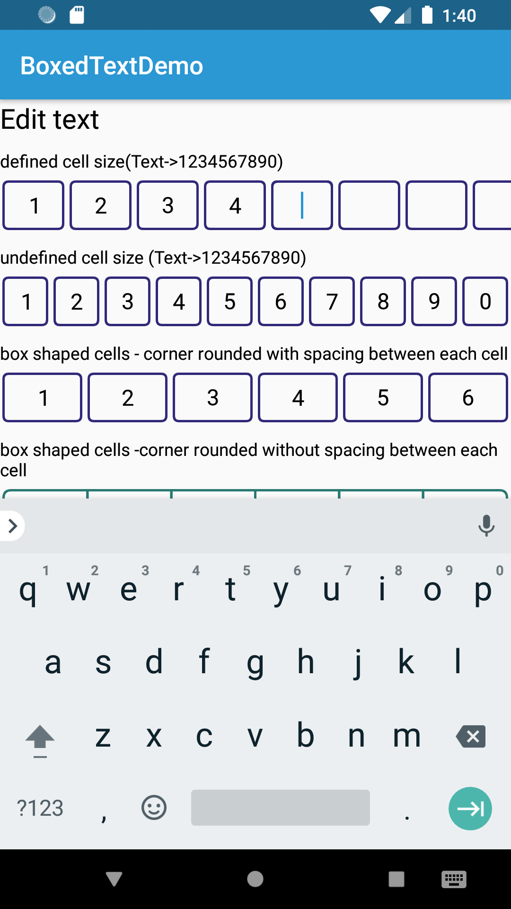

# BoxedView

This app is for the BoxedView library demo

 

## Steps to run the app

* Clone this repo locally
  ```
  git clone https://github.com/selva27/BoxedView.git
  ```
* Build and run it on an Android device

## Demo
[Demo.apk](demo/demo.apk)

## How to use
    ```
    app:bt_itemCount="10dp"(cell count)
    app:bt_itemWidth="50dp"(width of each item)
    app:bt_itemHeight="10dp"(height of each item)
    app:bt_itemRadius="10dp"(corner radius)
    app:bt_itemSpacing="5dp"(spacing between each item)
    app:bt_lineWidth="2dp"(box width)
    app:bt_lineColor=""(color of line or rectangle)
    app:bt_viewType="line||rectangle"(shape of the background)

    for edit text
    app:bt_cursorWidth="l2dp"(cursor width)
    app:bt_cursorColor="#fff"
    android:cursorVisible="true||false"

    ```


## License
[Apache-2](./License.txt) license.
